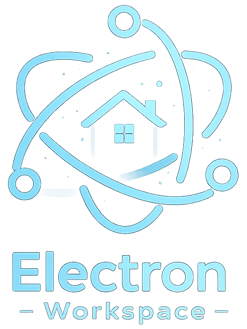

<p align="center">
    
</p>

<div align="center">


</div>

## 🧭 Guia de Navegação (Índice)

- **[📖 Descrição](#descricao)**
- **[🚀 Projetos](#projetos)**
- **[📥 Clonar o Repositório](#clonar-repositorio)**
- **[⚙️ Como executar os projetos](#como-executar)**
- **[👤 Sobre o Desenvolvedor](#sobre-o-desenvolvedor)**
- **[📚 Recursos Adicionais](#recursos-adicionais)**
- **[📜 Licença](#licenca)**

## Electron Workspace

## 📖 Descrição <a name="descricao"></a>

Este repositório contém diversas aplicações desenvolvidos com Electron, cada um com propósitos e tecnologias variadas.

## 🚀 Projetos <a name="projetos"></a>

|                    |
| ------------------ |
| image-resizer      |
| ipc                |
| meu-hello-electron |
| my-clock-app       |
| my-electron-app    |
| my-note-app        |
| my-pomodoro-app    |
| neo-browser        |
| pressound          |
| react-vite-starter |
| resonus            |
| screen-capturer    |
| tuturu-timer       |
| user-lite          |

## 📥 Clonar o Repositório <a name="clonar-repositorio"></a>

Para obter uma cópia local do workspace, execute:

```bash
git clone https://github.com/0nF1REy/electron-workspace.git
cd electron-workspace
```

## ⚙️ Como executar os projetos <a name="como-executar"></a>

Cada projeto possui seu próprio `package.json` e pode ser executado individualmente. Para rodar um projeto:

```bash
cd projects/nome-do-projeto
npm install
npm start
```

## 👤 Sobre o Desenvolvedor <a name="sobre-o-desenvolvedor"></a>

<table align="center">
  <tr>
    <td align="center">
        <br>
        <a href="https://github.com/0nF1REy" target="_blank">
          
        </a>
        </p>
        <a href="https://github.com/0nF1REy" target="_blank">
          <strong>Alan Ryan</strong>
        </a>
        </p>
        ☕ Peopleware | Tech Enthusiast | Code Slinger ☕
        <br>
        Apaixonado por código limpo, arquitetura escalável e experiências digitais envolventes
        </p>
          Conecte-se comigo:
        </p>
        <a href="https://www.linkedin.com/in/alan-ryan-b115ba228" target="_blank">
          
        </a>
        <a href="https://gitlab.com/alanryan619" target="_blank">
          
        </a>
        <a href="mailto:alanryan619@gmail.com" target="_blank">
          
        </a>
        </p>
    </td>
  </tr>
</table>

</div>

---

## 📚 Recursos Adicionais <a name="recursos-adicionais"></a>

- [Documentação Oficial do Electron](https://www.electronjs.org/docs/latest)
- [Guia de Segurança do Electron](https://www.electronjs.org/docs/latest/tutorial/security)
- [Electron Forge – Ferramenta de Build e Empacotamento](https://www.electronforge.io/)

## 📜 Licença <a name="licenca"></a>

Este projeto está sob a **licença MIT**. Consulte o arquivo **[LICENSE](LICENSE)** para obter mais detalhes.

> ℹ️ **Aviso de Licença:** &copy; 2025-2026 Alan Ryan da Silva Domingues. Este projeto está licenciado sob os termos da licença MIT. Isso significa que você pode usá-lo, copiá-lo, modificá-lo e distribuí-lo com liberdade, desde que mantenha os avisos de copyright.

⭐ Se este repositório foi útil para você, considere dar uma estrela!
